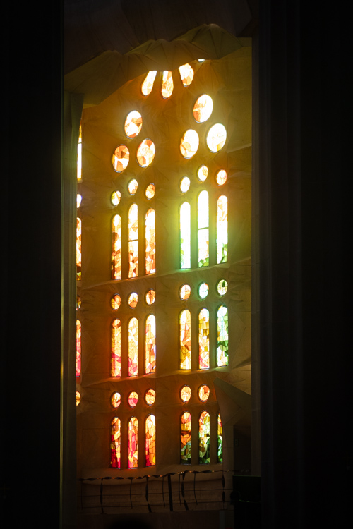
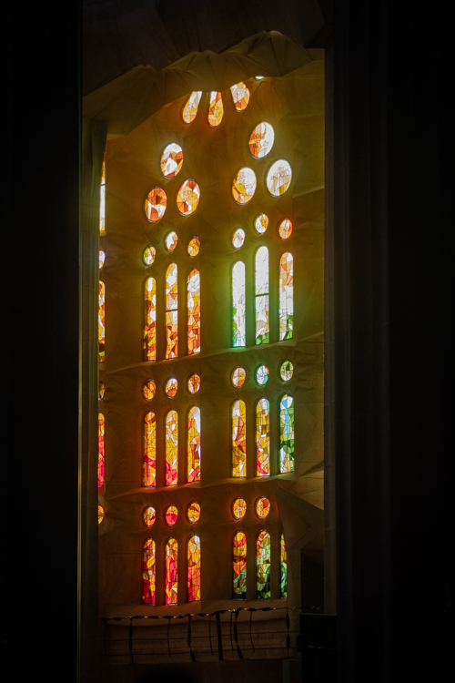

# Lightroom UltraHDR

A Lightroom Classic plugin that merges an SDR edited photo and its HDR edited virtual copy to achieve a .jpg with hdr support via gainap, meaning clean sdr fallback.

### why not just use the built in way?

while Lightroom **does** have .jpg hdr support with gainmap, this plugin is meant to tackle a very specific issue: when enabling hdr editing in a photo, the sdr fallback is automatically changed, resulting in poor experience for non hdr compatible devices. this is especially noticed in the duller highlights.

### Example:
|| default SDR export | Plugin export | default HDR export |
|---|:------------------------------------------:|:------------------------------------------:|:------------------------------------------:|
|SDR||||
|HDR||||
||:x:**no hdr support** |✅sdr identical to sdr mode|⚠️unreliable sdr fallback|
> Please view this table in an hdr compatible enviroment


## Installation

Download the latest .zip from the  [Releases](../../releases) page, unzip it, and add it in Lightroom via
**File ▸ Plug-in Manager ▸ Add**.


## Usage

1. Take your photo and create an virtual copy of it. edit the copy with hdr mode enabled, and teh base image in sdr.
2. Select both in the Library grid.
3. **File ▸ Plug-in Extras ▸ Merge SDR + HDR to UltraHDR…**
4. Pick an output location and run.

The plugin figures out which selected photo is the HDR one and which is the SDR
one automatically, exports both renditions, and writes the merged UltraHDR JPEG.

### build from source

Requires CMake, a C++17 compiler (MSVC on Windows), `git`, and
[NASM](https://www.nasm.us/) (libjpeg-turbo's SIMD needs it). libultrahdr is
fetched from upstream at configure time (pinned to an exact commit) and built from
source together with its libjpeg-turbo dependency — nothing third-party is
committed to this repo.
The plugin is built on
[libultrahdr](https://github.com/google/libultrahdr); there is no ffmpeg or
external dependency at runtime.

```bash
cmake -B build
cmake --build build --config Release --target uhdrtool
```

That produces `build/Release/uhdrtool.exe` and copies it into the plugin bundle
at `lua/lightroom-hdr.lrplugin/bin/win/` automatically.

`uhdrtool` on its own:

```
uhdrtool --hdr input.tif --sdr input.jpg --out result.jpg
```

`--hdr` is a 32-bit float TIFF (Lightroom HDR export, "Maximize Compatibility"
**off**); `--sdr` is a standard JPEG of the same image.

## Layout

| Path              | What                                                        |
| ----------------- | ----------------------------------------------------------- |
| `src/`            | `uhdrtool` C++ source (TIFF reader, gain-map encoder)       |
| `lua/`            | the `.lrplugin` Lightroom plugin                            |
| `licenses/`       | third-party attribution (`NOTICE.md`)                       |
| `.github/`        | CI: build, package the bundle, publish on tag               |
| `images/`        | sample images for this readme page              |


